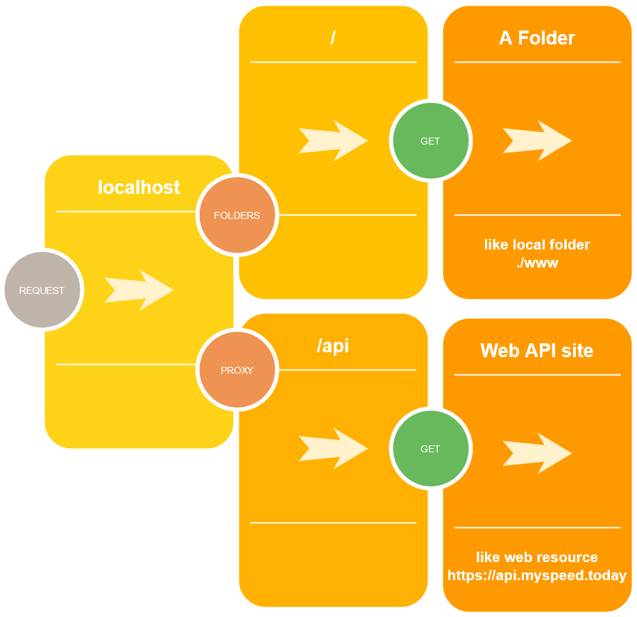

# Express reverse proxy CLI tool [](https://www.linkedin.com/in/lopatnov/)

A back-end (Node.js) development tool to serve front-end projects with back-end reverse proxy for API. Configure a tool and serve your front-end projects.

- [Installation](#installation)
- [Run installed server](#run-installed-server)
- [Run without installation](#run-without-installation)
- [Configuration](#configuration)
- [Configuration Recipes](#configuration-recipes)
- [Rights and Agreements](#rights-and-agreements)

## Installation

[](https://www.npmjs.com/package/@lopatnov/express-reverse-proxy)

```shell
npm install --save-dev @lopatnov/express-reverse-proxy
```

## Run installed server

```shell
express-reverse-proxy
```

### Running Options

- `--help` shows command line help
- `--config <file name>` sets server configuration file. Default value is `server-config.json`. See [configuration file example by this link](./server-config.json).

```shell
express-reverse-proxy --config ./server-config.json
```

## Run without installation

```bash
npx @lopatnov/express-reverse-proxy
```

## Configuration

Edit `server-config.json` file



### Configure server port

```json
{
  "port": 8080
  // ...
}
```

To configure server port, edit `port` variable. The default server port is `8080`.

### Configure `headers` variable

To set headers for all requests use `headers` variable

```json
{
  // ...
  "headers": {
    "Access-Control-Allow-Origin": "*"
  }
  // ...
}
```

### Configure `folders` variable

The `folders` is a variable to serve static files such as images, CSS files, and JavaScript files.

#### Serve static files from a single directory

```json
{
  "folders": "www"
}
```

This configuration means that the server will serve static files from a local `www` directory. The `folders` variable can changed by a value of relative path like "./www", "../../my-nice-project/www" or "./project/my-front-end-files".

#### Serve static files from multiple directories

```json
{
  "folders": ["./www", "./mock-json", "../../images"]
}
```

This configuration means that the server will serve static files from multiple directories:

- `./www`
- `./mock-json`
- `../../images`

#### Map url path to serve static files from directories

```json
{
  "folders": {
    "/": "dist",
    "/api": "./mock-json",
    "/assets": {
      "/images": "./images",
      "/css": "./scss/dist",
      "/script": "./scripts"
    }
  }
}
```

This configuration means that the server will serve static files from multiple directories. The url path maps to this directories.

In example above you can see the next mapping:

```txt
url: /
directory: dist

url: /api
directory: ./mock-json

url: /assets/images
directory: ./images

url: /assets/css
directory: ./scss/dist

url: /assets/script
directory: ./scripts
```

### Configure `proxy` variable

The `proxy` variable intended for request redirect to 3rd-party server and getting result of this response.

#### Connect API to front-end project

```json
{
  "port": 4200,
  "folders": "www",
  "proxy": {
    "/api": "localhost:8000"
  }
}
```

This configuration means that the server will serve static files from a local `www` directory on 4200 port with remote API on <http://localhost:8000>. When the web-site makes request to "/api" path, the request will redirect to remote server with <localhost:8000> address.

### Configure `unhandled` variable

To handle unhandled requests use `unhandled` variable. It's behavior depends on Accept header. It can be used any accept header.

```json5
{
  ...
  "unhandled": {
    "html": { // <-- Accept header for html requests
      ...
    },
    "json": { // <-- Accept header for json requests
      ...
    },
    "xml": { // <-- Accept header for xml requests
      ...
    },
    "*": { // <-- Any accept header
      ...
    }
  }
  ...
}
```

Each accept header can contain its options.

```json5
"html": { // <-- Accept header for HTML requests (for example)
  "status": 307, // <-- Response status code Temporary redirect, see 307 http status code
  "headers": {  // <-- Headers
    "Location": "/"
  }
},

"json": { // <-- Accept header for json requests
  "status": 404, // <-- Response status code Not Found
  "send": { // Response JSON object
    "error": "JSON Not Found"
  }
},

"xml": { // <-- Accept header for XML requests
  "status": 404, // <-- Response status code Not Found
  "send": "<error>Not Found</error>" // Response is text
},

"*": { // <-- Any accept header
  "status": 404,  // <-- Response status code Not Found
  "file": "./www/not-found.txt" // Response read from file "./www/not-found.txt"
}
```

## Configuration Recipes

### Request a static file, than make request to back-end

Server listening in 8080 port

- Request --> Search static file in "www" folder --> File found --> Response is the file
- Request --> Search static file in "www" folder --> File not found --> Make request to back-end <http://localhost:4000/current-path> --> Response from the back-end

```json
{
  "port": 8080,
  "folders": "www",
  "proxy": "localhost:4000"
}
```

### Request API by path that starts as `/api`, otherwise request front-end by default

Server listening in 8080 port

- Request --> Search static file in "www" folder --> File found --> Response is the file
- Request --> Search static file in "www" folder --> File not found --> Response 404 Not Found
- Request /api/current-path --> Make request to back-end <http://localhost:4000/current-path> --> Response from the back-end

```json
{
  "port": 8080,
  "folders": "www",
  "proxy": {
    "/api": "localhost:4000"
  }
}
```

## Rights and Agreements

License [Apache-2.0](https://github.com/lopatnov/static-server-express/blob/master/LICENSE)

Copyright 2020–2021 Oleksandr Lopatnov
